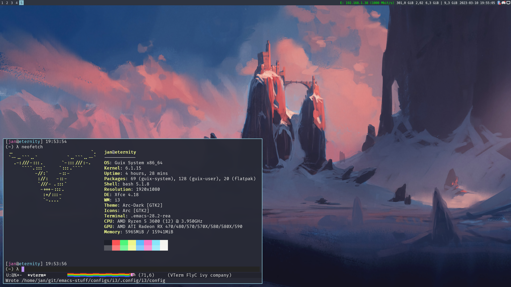

# The Q333 (aka CuBeRJAN) dotfile collection

This repo contains all (most) of my personal dotfiles and configs.

Current available configurations are for EXWM, Gnome (with dash to dock and appindicators), XFCE (with the pretty Arc theme) and XFCE+i3 (needs some extra configuration!). My dwm config _might_ come later.

All configurations are currently for use exclusively with GNU Guix, nonguix channel included for firmware.



---

Install configurations using GNU Stow:

```bash
stow configs/* -t ~ --adopt && git reset --hard # Force overwrite existing
sudo cp /etc/config.scm /etc/config.old.scm # Backup old config, mostly for drive setup and bootloader config
sudo stow configs-root/* -t / --adopt && git reset --hard 

# Now adjust bootloader options and drive setup in /etc/config.scm!!!

sudo chown -R root configs-root # Wouldn't want non-root access to system files!
guix pull
sudo guix archive --authorize < /etc/signing-key.pub # Authorize key for nonguix
sudo guix system reconfigure /etc/config.scm --substitute-urls='https://ci.guix.gnu.org https://bordeaux.guix.gnu.org https://substitutes.nonguix.org' # Reconfigure system with nonguix substitutes
guix package -m ~/.guix-manifest # install profile package manifest
reboot # Should be all done!
```

* My profile package manifest is available in ``~/.guix-manifest``, has to be updated manually with ``guix package --export-manifest > ~/.guix-manifest``!
* ``~/.loginctl`` is the on-login script, edit when needed
* Emacs is pretty much just startup-and-use, but a ``(package-install-selected-packages)`` may be necessary the first time around
* Live Markdown preview is automatic, use ``impatient-mode`` for HTML preview
* To use Gnome switch to ``(gnome-desktop-service-type)`` in ``/etc/config.scm``  
* XFCE + i3 requires changes to XFCE settings, - disable XFCE keyboard shortcuts, ``xfdesktop`` and ``xfwm`` and start ``i3`` with ``picom`` instead.
* EXWM has to be enabled with a special variable in the ``~/.emacs`` file, also requires disabling ``gdm`` in system config and using the special ``~/.startx`` instead, with emacs started from ``~/.xinitrc``
* Custom ``steam-patched`` package is used, exposes my second HDD with games to the Steam sandbox
* ``distrobox-docker`` is distrobox but repackaged for use with docker (duh), fully usable in rootless mode!

---

* This repo is meant for personal use, the README here is mostly just for myself, in case I forget how to use the dotfiles :)
